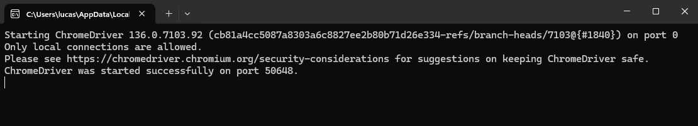

# Automação de Testes com Robot Framework



robot -d ./Logs -i Funcional ./tests/test_calculadora.robot


Este projeto é um exemplo simples de automação de testes utilizando o [Robot Framework](https://robotframework.org/), com foco em testes funcionais de uma calculadora online. A automação cobre cenários de soma simples, soma com número negativo e números com vírgula.

---

## ✅ Pré-requisitos

Antes de começar, verifique se você tem instalado:

- [Python 3.8+](https://www.python.org/downloads/)
- [pip](https://pip.pypa.io/en/stable/installation/)
- [Google Chrome](https://www.google.com/chrome/)
- [ChromeDriver](https://googlechromelabs.github.io/chrome-for-testing/) compatível com sua versão do Chrome. Colar o arquivo e executar o chromedriver no diretório AppData\Local\Programs\Python\Python310\Scripts

- `pip install robotframework` no CMD
- `pip install robotframework-pythonlibcore` no CMD
---

## 📦 Instalação

1. **Clone o repositório:**
   ```bash
   git clone https://github.com/LucasHenriqueFM/Desafio_Leme.git