### Cenário 01: Validação do Campo Nome Preenchido
Testar se o campo nome está aceitando ao ser preenchido

**Requisitos**  
Estar dentro da página de contatos "https://homologa.lemeforense.com.br/contato/"

```
**Passo a passo**  
1. Digitar um nome completo (Ex: João da Silva)
2. Digitar e-mail corporativo válido
3. Digitar um telefone válido
4. Selecionar um cargo
5. Selecionar um setor
6. Selecionar o que você está buscando
7. Selecionar a quantidade de processos
8. Selecionar o tamanho da empresa
9. Selecionar Se já cliente LEME
10. Aceitar o termo de política de privacidade
11. Aceitar receber informativos e novidades.
```
**Critério de aceitação**  
Deve aceitar o campo nome preenchido corretamente

**Resultado**  
Campo Nome está aceitando o preenchimento corretamente, mas os demais campos estão com erros

**Evidência referente ao cenário 01**
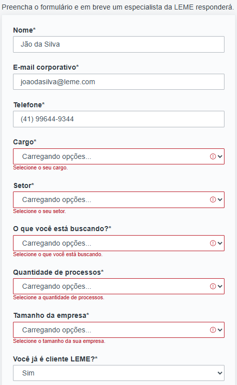


------------------------------------------


### Cenário 02: Validação do Campo Nome Vazio
Testar se o campo nome vazio não aceita

**Requisitos**  
Estar dentro da página de contatos "https://homologa.lemeforense.com.br/contato/"

```
**Passo a passo**  
1. Deixar o campo Nome vazio
2. Digitar e-mail corporativo válido
3. Digitar um telefone válido
4. Selecionar um cargo
5. Selecionar um setor
6. Selecionar o que você está buscando
7. Selecionar a quantidade de processos
8. Selecionar o tamanho da empresa
9. Selecionar Se já cliente LEME
10. Aceitar o termo de política de privacidade
11. Aceitar receber informativos e novidades.
```
**Critério de aceitação**  
Não deve aceitar o campo nome não estando preenchido

**Resultado**  
Mostrando a mensagem que o campo Nome está vazio

**Evidência referente ao cenário 02**      
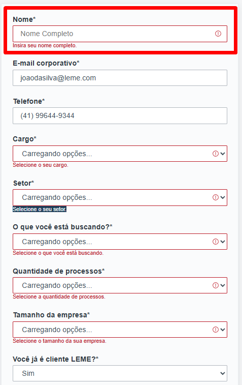


------------------------------------------


### Cenário 03: Validação do Campo E-mail Corporativo Preenchido
Testar se o campo e-mail corporativo está aceitando ao ser preenchido

**Requisitos**  
Estar dentro da página de contatos "https://homologa.lemeforense.com.br/contato/"

```
**Passo a passo**  
1. Digitar um nome completo (Ex: João da Silva)
2. Digitar e-mail corporativo válido
3. Digitar um telefone válido
4. Selecionar um cargo
5. Selecionar um setor
6. Selecionar o que você está buscando
7. Selecionar a quantidade de processos
8. Selecionar o tamanho da empresa
9. Selecionar Se já cliente LEME
10. Aceitar o termo de política de privacidade
11. Aceitar receber informativos e novidades.
```
**Critério de aceitação**  
Deve aceitar o campo e-mail preenchido corretamente

**Resultado**  
Campo e-mail está aceitando o preenchimento corretamente, mas os demais campos estão com erros

**Evidência referente ao cenário 03**
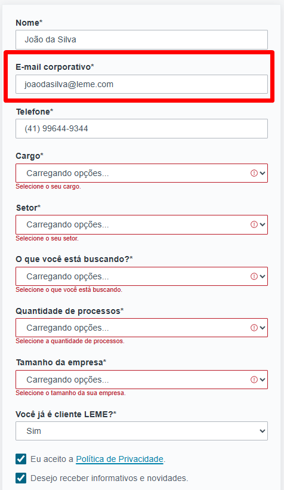


------------------------------------------

### Cenário 04: Validação do Campo E-mail Não Corporativo
Testar se o campo e-mail corporativo aceita outros tipos de e-mails

**Requisitos**  
Estar dentro da página de contatos "https://homologa.lemeforense.com.br/contato/"

```
**Passo a passo**  
1. Digitar um nome completo (Ex: João da Silva)
2. Digitar um e-mail não corporativo
3. Digitar um telefone válido
4. Selecionar um cargo
5. Selecionar um setor
6. Selecionar o que você está buscando
7. Selecionar a quantidade de processos
8. Selecionar o tamanho da empresa
9. Selecionar Se já cliente LEME
10. Aceitar o termo de política de privacidade
11. Aceitar receber informativos e novidades.
```
**Critério de aceitação**  
Não deve aceitar o campo e-mail sem ser corporativo

**Resultado**  
Campo e-mail não está aceitando sem ser e-mail corporativo

**Evidência referente ao cenário 04**
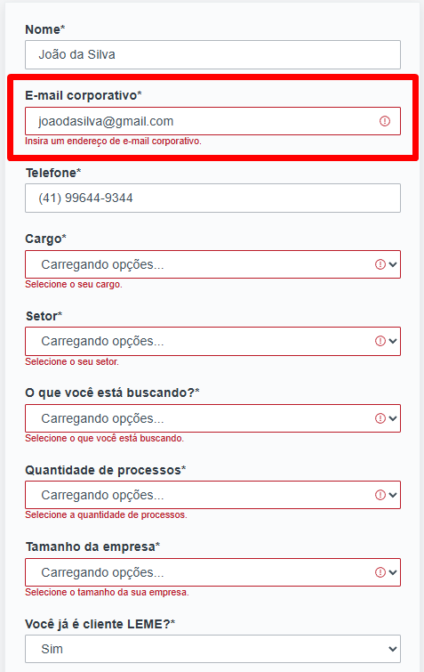


------------------------------------------


### Cenário 05: Validação do Campo E-mail Corporativo Vazio
Testar se o campo e-mail corporativo não aceita campo vazio
**Requisitos**  
Estar dentro da página de contatos "https://homologa.lemeforense.com.br/contato/"

```
**Passo a passo**  
1. Digitar um nome completo (Ex: João da Silva)
2. Deixar o campo e-mail corporativo vazio
3. Digitar um telefone válido
4. Selecionar um cargo
5. Selecionar um setor
6. Selecionar o que você está buscando
7. Selecionar a quantidade de processos
8. Selecionar o tamanho da empresa
9. Selecionar Se já cliente LEME
10. Aceitar o termo de política de privacidade
11. Aceitar receber informativos e novidades.
```
**Critério de aceitação**  
Não deve aceitar o campo e-mail sem estar preenchido

**Resultado**  
Campo e-mail não está aceitando sem ser e-mail preenchido

**Evidência referente ao cenário 05**
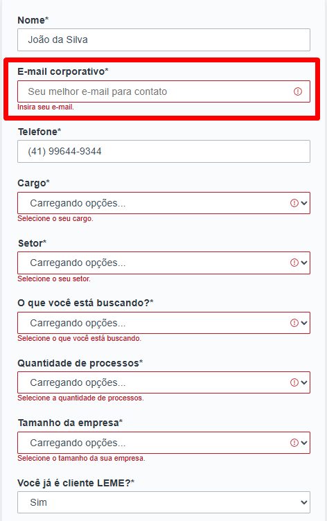


------------------------------------------


### Cenário 06: Validação do Campo E-mail Sem Dominio
Testar se o campo e-mail corporativo não aceita e-mail sem dominio
**Requisitos**  
Estar dentro da página de contatos "https://homologa.lemeforense.com.br/contato/"

```
**Passo a passo**  
1. Digitar um nome completo (Ex: João da Silva)
2. Digitar um e-mail sem dominio (Ex: joaosilva)
3. Digitar um telefone válido
4. Selecionar um cargo
5. Selecionar um setor
6. Selecionar o que você está buscando
7. Selecionar a quantidade de processos
8. Selecionar o tamanho da empresa
9. Selecionar Se já cliente LEME
10. Aceitar o termo de política de privacidade
11. Aceitar receber informativos e novidades.
```
**Critério de aceitação**  
Não deve aceitar o campo e-mail sem conter dominio corporativo

**Resultado**  
Campo e-mail não está aceitando sem possuir um dominio corporativo

**Evidência referente ao cenário 06**
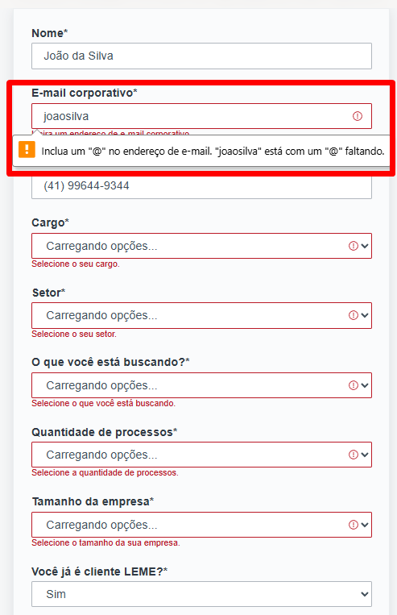


------------------------------------------


### Cenário 07: Validação do Campo Telefone Preenchido
Testar se o campo telefone está aceitando ao ser preenchido

**Requisitos**  
Estar dentro da página de contatos "https://homologa.lemeforense.com.br/contato/"

```
**Passo a passo**  
1. Digitar um nome completo (Ex: João da Silva)
2. Digitar e-mail corporativo válido
3. Digitar um telefone válido
4. Selecionar um cargo
5. Selecionar um setor
6. Selecionar o que você está buscando
7. Selecionar a quantidade de processos
8. Selecionar o tamanho da empresa
9. Selecionar Se já cliente LEME
10. Aceitar o termo de política de privacidade
11. Aceitar receber informativos e novidades.
```
**Critério de aceitação**  
Deve aceitar o campo telefone preenchido corretamente

**Resultado**  
Campo telefone está aceitando o preenchimento corretamente, mas os demais campos estão com erros

**Evidência referente ao cenário 07**
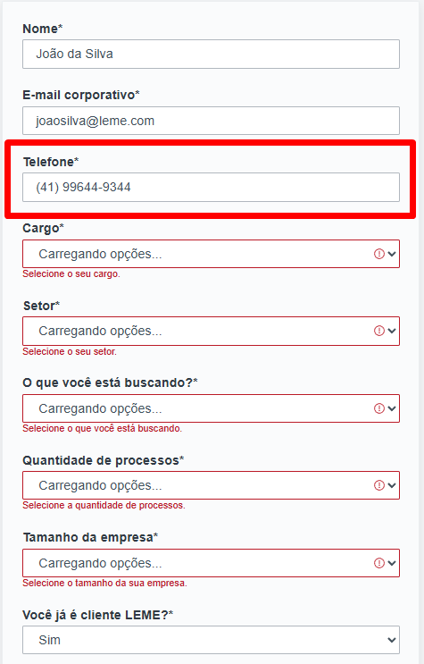

------------------------------------------


### Cenário 08: Validação do Campo Telefone vazio
Testar se o campo telefone está aceitando ao estar vazio

**Requisitos**  
Estar dentro da página de contatos "https://homologa.lemeforense.com.br/contato/"

```
**Passo a passo**  
1. Digitar um nome completo (Ex: João da Silva)
2. Digitar e-mail corporativo válido
3. Deixar o campo telefone vazio
4. Selecionar um cargo
5. Selecionar um setor
6. Selecionar o que você está buscando
7. Selecionar a quantidade de processos
8. Selecionar o tamanho da empresa
9. Selecionar Se já cliente LEME
10. Aceitar o termo de política de privacidade
11. Aceitar receber informativos e novidades.
```
**Critério de aceitação**  
Não deeve aceitar o campo telefone vazio

**Resultado**  
Campo telefone não está aceitando o preenchimento corretamente, mas os demais campos estão com erros

**Evidência referente ao cenário 08**


------------------------------------------


### Cenário 09: Cargo Selecionado
Testar se o campo está aceitando algum cargo

**Requisitos**  
Estar dentro da página de contatos "https://homologa.lemeforense.com.br/contato/"

```
**Passo a passo**  
1. Digitar um nome completo (Ex: João da Silva)
2. Digitar e-mail corporativo válido
3. Digitar um telefone válido
4. Selecionar um cargo
5. Selecionar um setor
6. Selecionar o que você está buscando
7. Selecionar a quantidade de processos
8. Selecionar o tamanho da empresa
9. Selecionar Se já cliente LEME
10. Aceitar o termo de política de privacidade
11. Aceitar receber informativos e novidades.
```
**Critério de aceitação**  
Deve aceitar apenas com cargo selecionado

**Resultado**  
Erro ao selecionar um cargo, não está mostrando os cargos

**Evidência referente ao cenário 09**
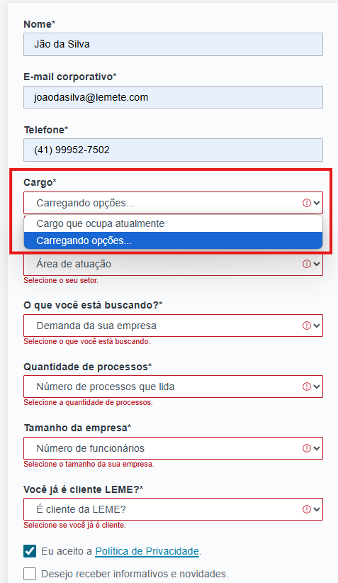


------------------------------------------


### Cenário 10: Cargo Não Selecionado
Testar se o campo está aceitando nenhum cargo

**Requisitos**  
Estar dentro da página de contatos "https://homologa.lemeforense.com.br/contato/"

```
**Passo a passo**  
1. Digitar um nome completo (Ex: João da Silva)
2. Digitar e-mail corporativo válido
3. Digitar um telefone válido
4. Não Selecionar o 'cargo'
5. Selecionar um setor
6. Selecionar o que você está buscando
7. Selecionar a quantidade de processos
8. Selecionar o tamanho da empresa
9. Selecionar Se já cliente LEME
10. Aceitar o termo de política de privacidade
11. Aceitar receber informativos e novidades.
```
**Critério de aceitação**  
Não deve aceitar com nenhum cargo selecionado

**Resultado**  
Erro ao selecionar um cargo, não está mostrando os cargos

**Evidência referente ao cenário 10**
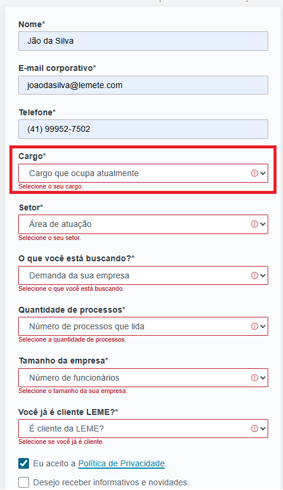

------------------------------------------


### Cenário 11: Setor Selecionado
Testar se o campo está aceitando algum setor

**Requisitos**  
Estar dentro da página de contatos "https://homologa.lemeforense.com.br/contato/"

```
**Passo a passo**  
1. Digitar um nome completo (Ex: João da Silva)
2. Digitar e-mail corporativo válido
3. Digitar um telefone válido
4. Selecionar um cargo
5. Selecionar um setor
6. Selecionar o que você está buscando
7. Selecionar a quantidade de processos
8. Selecionar o tamanho da empresa
9. Selecionar Se já cliente LEME
10. Aceitar o termo de política de privacidade
11. Aceitar receber informativos e novidades.
```
**Critério de aceitação**  
Deve aceitar apenas com Setor selecionado

**Resultado**  
Erro ao selecionar um Setor,não está mostrando os setores

**Evidência referente ao cenário 11**
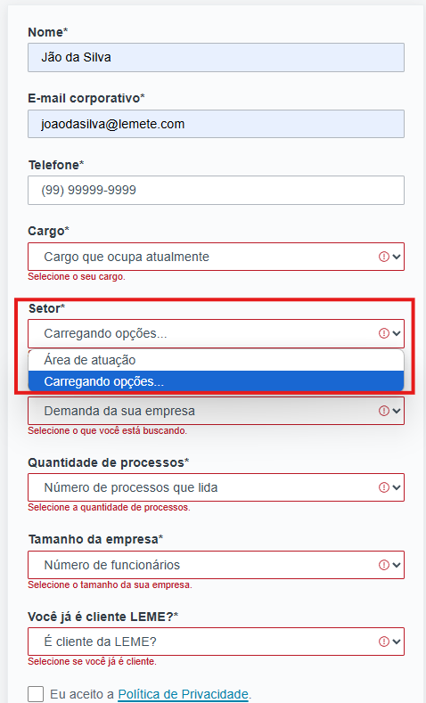


------------------------------------------


### Cenário 12: Setor Não Selecionado
Testar se o campo está aceitando nenhum setor

**Requisitos**  
Estar dentro da página de contatos "https://homologa.lemeforense.com.br/contato/"

```
**Passo a passo**  
1. Digitar um nome completo (Ex: João da Silva)
2. Digitar e-mail corporativo válido
3. Digitar um telefone válido
4. Selecionar um cargo
5. Não selecionar nenhum setor
6. Selecionar o que você está buscando
7. Selecionar a quantidade de processos
8. Selecionar o tamanho da empresa
9. Selecionar Se já cliente LEME
10. Aceitar o termo de política de privacidade
11. Aceitar receber informativos e novidades.
```
**Critério de aceitação**  
Não deve aceitar com nenhum setor selecionado

**Resultado**  
Erro ao selecionar um setor, não está mostrando os setores

**Evidência referente ao cenário 12**


------------------------------------------


### Cenário 13: O que Você Está Buscando Selecionado
Testar se o campo está aceitando o que você está buscando

**Requisitos**  
Estar dentro da página de contatos "https://homologa.lemeforense.com.br/contato/"

```
**Passo a passo**  
1. Digitar um nome completo (Ex: João da Silva)
2. Digitar e-mail corporativo válido
3. Digitar um telefone válido
4. Selecionar um cargo
5. Selecionar um setor
6. Selecionar o que você está buscando
7. Selecionar a quantidade de processos
8. Selecionar o tamanho da empresa
9. Selecionar Se já cliente LEME
10. Aceitar o termo de política de privacidade
11. Aceitar receber informativos e novidades.
```
**Critério de aceitação**  
Deve aceitar apenas com o que você está buscando selecionado

**Resultado**  
Erro ao selecionar o que você está buscando, não está mostrando as opções

**Evidência referente ao cenário 13**


------------------------------------------


### Cenário 14: O que Você Está Buscando Não Selecionado
Testar se o campo o que você está buscando selecionado não está aceitando nenhuma opção

**Requisitos**  
Estar dentro da página de contatos "https://homologa.lemeforense.com.br/contato/"

```
**Passo a passo**  
1. Digitar um nome completo (Ex: João da Silva)
2. Digitar e-mail corporativo válido
3. Digitar um telefone válido
4. Selecionar um cargo
5. Selecionar um setor
6. Não selecionar nenhuma opção em o que você está buscando
7. Selecionar a quantidade de processos
8. Selecionar o tamanho da empresa
9. Selecionar Se já cliente LEME
10. Aceitar o termo de política de privacidade
11. Aceitar receber informativos e novidades.
```
**Critério de aceitação**  
Não deve aceitar nenhuma opção do que você está buscando

**Resultado**  
Erro ao selecionar o que você está buscando, não está mostrando os as opções

**Evidência referente ao cenário 14**
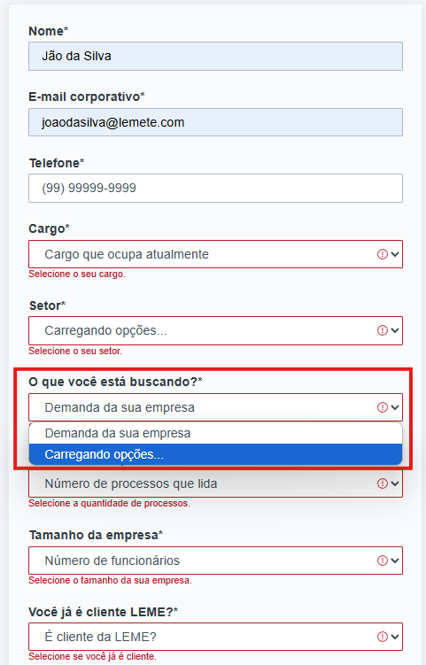


-------------------------------------------------------------------------------


### Cenário 15: Quantidade De Processos Selecionados
Testar se o campo está aceitando o que você está buscando no campo quantidade de processos

**Requisitos**  
Estar dentro da página de contatos "https://homologa.lemeforense.com.br/contato/"

```
**Passo a passo**  
1. Digitar um nome completo (Ex: João da Silva)
2. Digitar e-mail corporativo válido
3. Digitar um telefone válido
4. Selecionar um cargo
5. Selecionar um setor
6. Selecionar o que você está buscando
7. Selecionar a quantidade de processos
8. Selecionar o tamanho da empresa
9. Selecionar Se já cliente LEME
10. Aceitar o termo de política de privacidade
11. Aceitar receber informativos e novidades.
```
**Critério de aceitação**  
Deve aceitar apenas com o que está selecionado no campo quantidade de processos

**Resultado**  
Erro ao selecionar alguma opção do campo quantidade de processos, não está mostrando as opções

**Evidência referente ao cenário 15**
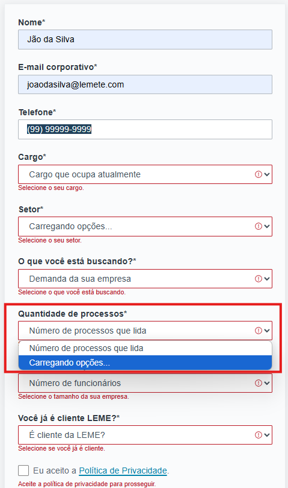


------------------------------------------


### Cenário 16: Quantidade De Processos Não Selecionado
Testar se o campo quantidade de processos não está sendo aceito sem alguma opção

**Requisitos**  
Estar dentro da página de contatos "https://homologa.lemeforense.com.br/contato/"

```
**Passo a passo**  
1. Digitar um nome completo (Ex: João da Silva)
2. Digitar e-mail corporativo válido
3. Digitar um telefone válido
4. Selecionar um cargo
5. Selecionar um setor
6. Selecionar algo no campo o que você está buscando
7. Selecionar nada no campo quantidade de processos
8. Selecionar o tamanho da empresa
9. Selecionar Se já cliente LEME
10. Aceitar o termo de política de privacidade
11. Aceitar receber informativos e novidades.
```
**Critério de aceitação**  
Não deve aceitar o campo quantidade de preocessos vazio

**Resultado**  
Erro ao selecionar alguma opção do campo quantidade de processos, não está mostrando as opções

**Evidência referente ao cenário 16**


-------------------------------------------------------------------------------


### Cenário 17: Tamanho da empresa Selecionados
Testar se o campo tamanho da empresa está aceitando a opção que foi passada

**Requisitos**  
Estar dentro da página de contatos "https://homologa.lemeforense.com.br/contato/"

```
**Passo a passo**  
1. Digitar um nome completo (Ex: João da Silva)
2. Digitar e-mail corporativo válido
3. Digitar um telefone válido
4. Selecionar um cargo
5. Selecionar um setor
6. Selecionar o que você está buscando
7. Selecionar a quantidade de processos
8. Selecionar o tamanho da empresa
9. Selecionar Se já cliente LEME
10. Aceitar o termo de política de privacidade
11. Aceitar receber informativos e novidades.
```
**Critério de aceitação**  
Deve aceitar apenas com o que está selecionado no campo tamanho da empresa

**Resultado**  
Erro ao selecionar alguma opção do tamanho da empresas, não está mostrando as opções

**Evidência referente ao cenário 17**
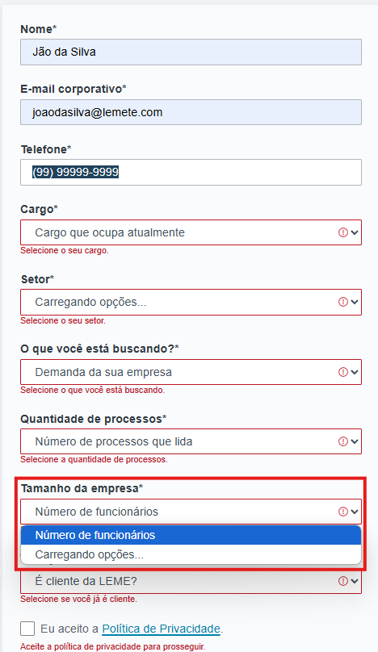


-------------------------------------------------------------------------------


### Cenário 18: Tamanho da empresa Não Selecionado
Testar se o campo tamanho da empresa não está sendo aceito sem alguma opção

**Requisitos**  
Estar dentro da página de contatos "https://homologa.lemeforense.com.br/contato/"

```
**Passo a passo**  
1. Digitar um nome completo (Ex: João da Silva)
2. Digitar e-mail corporativo válido
3. Digitar um telefone válido
4. Selecionar um cargo
5. Selecionar um setor
6. Selecionar algo no campo o que você está buscando
7. Selecionar algo no campo quantidade de processos
8. Selecionar nada no campo tamanho da empresa
9. Selecionar Se já cliente LEME
10. Aceitar o termo de política de privacidade
11. Aceitar receber informativos e novidades.
```
**Critério de aceitação**  
Não deve aceitar o campo tamanho da empresa vazio

**Resultado**  
Erro ao selecionar alguma opção do campo tamanho da empresa, não está mostrando as opções

**Evidência referente ao cenário 18**
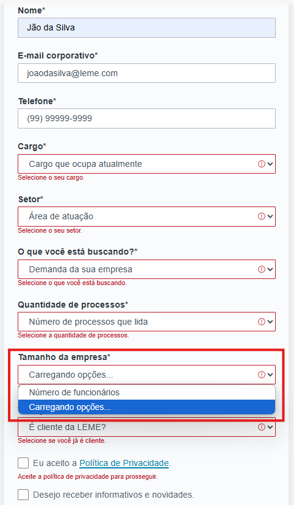


-------------------------------------------------------------------------------


### Cenário 19: Campo Você Já É Cliente LEME (SIM)
Testar se o campo você já é cliente LEME está aceitando a opção como SIM

**Requisitos**  
Estar dentro da página de contatos "https://homologa.lemeforense.com.br/contato/"

```
**Passo a passo**  
1. Digitar um nome completo (Ex: João da Silva)
2. Digitar e-mail corporativo válido
3. Digitar um telefone válido
4. Selecionar um cargo
5. Selecionar um setor
6. Selecionar o que você está buscando
7. Selecionar a quantidade de processos
8. Selecionar o tamanho da empresa
9. Selecionar a opção SIM no campo "você já cliente LEME?"
10. Aceitar o termo de política de privacidade
11. Aceitar receber informativos e novidades.
```
**Critério de aceitação**  
Deve aceitar a opção selecionada como SIM no campo "você já cliente LEME?"

**Resultado**  
Está sendo possivel selecionar a opção SIM no campo "você já cliente LEME?", mas não deixa finalizar por conta de estar dando erro nos outros campos

**Evidência referente ao cenário 19**
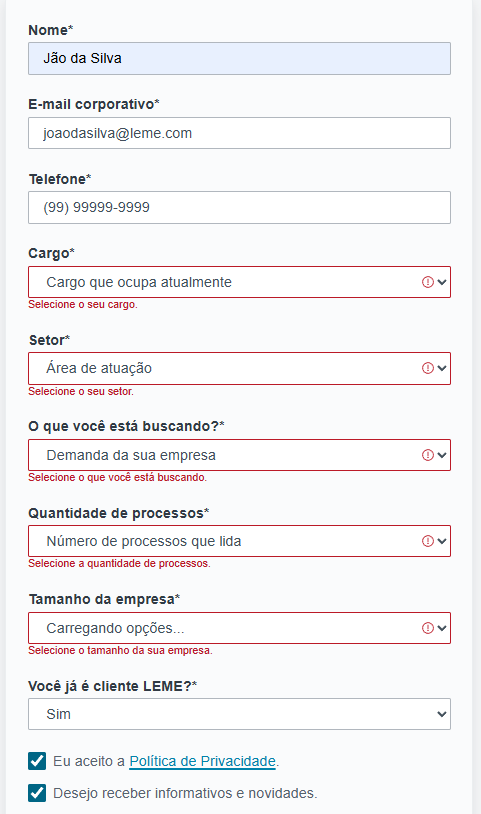


-------------------------------------------------------------------------------

### Cenário 20: Campo Você Já É Cliente LEME (NÃO)
Testar se o campo você já é cliente LEME está aceitando a opção como NÃO

**Requisitos**  
Estar dentro da página de contatos "https://homologa.lemeforense.com.br/contato/"

```
**Passo a passo**  
1. Digitar um nome completo (Ex: João da Silva)
2. Digitar e-mail corporativo válido
3. Digitar um telefone válido
4. Selecionar um cargo
5. Selecionar um setor
6. Selecionar o que você está buscando
7. Selecionar a quantidade de processos
8. Selecionar o tamanho da empresa
9. Selecionar a opção NÃO no campo "você já cliente LEME?"
10. Aceitar o termo de política de privacidade
11. Aceitar receber informativos e novidades.
```
**Critério de aceitação**  
Deve aceitar a opção selecionada como NÃO no campo "você já cliente LEME?"

**Resultado**  
Está sendo possivel selecionar a opção NÃO no campo "você já cliente LEME?", mas não deixa finalizar por conta de estar dando erro nos outros campos

**Evidência referente ao cenário 20**
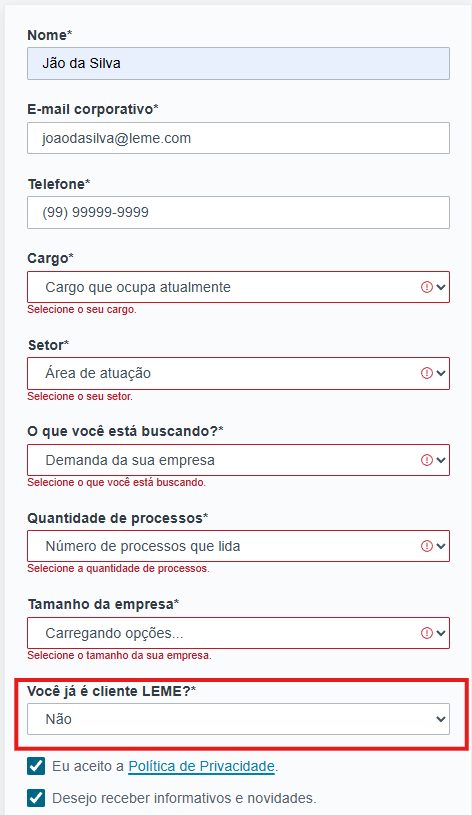


-------------------------------------------------------------------------------


### Cenário 21: Campo Você Já É Cliente LEME (vazio)
Testar se o campo você já é cliente LEME está aceitando ao selecionar nada

**Requisitos**  
Estar dentro da página de contatos "https://homologa.lemeforense.com.br/contato/"

```
**Passo a passo**  
1. Digitar um nome completo (Ex: João da Silva)
2. Digitar e-mail corporativo válido
3. Digitar um telefone válido
4. Selecionar um cargo
5. Selecionar um setor
6. Selecionar o que você está buscando
7. Selecionar a quantidade de processos
8. Selecionar o tamanho da empresa
9. Selecionar nenhuma opção no campo "você já cliente LEME?"
10. Aceitar o termo de política de privacidade
11. Aceitar receber informativos e novidades.
```
**Critério de aceitação** Não deve aceitar selecionar no campo "você já cliente LEME?"
estando vazio, e deve aparecer uma mensagem para selecionar

**Resultado**  
Não está aceitando a opção vazia no campo "você já cliente LEME?", mas não deixa finalizar por conta de estar dando erro nos outros campos

**Evidência referente ao cenário 21**
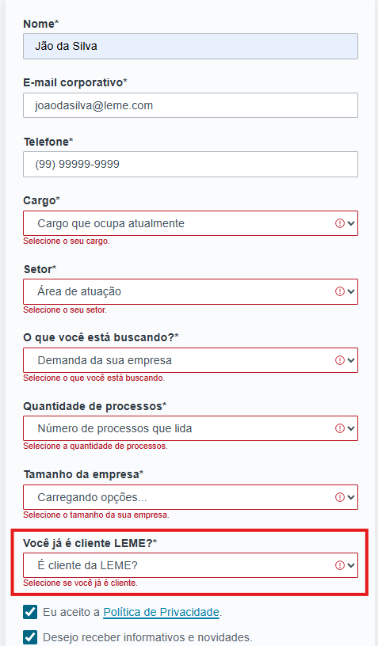


-------------------------------------------------------------------------------


### Cenário 22: Politica De Privacidade (SIM)
Testar se está aceitando o checkbox marcado como sim para aceitar a politica de privacidade

**Requisitos**  
Estar dentro da página de contatos "https://homologa.lemeforense.com.br/contato/"

```
**Passo a passo**  
1. Digitar um nome completo (Ex: João da Silva)
2. Digitar e-mail corporativo válido
3. Digitar um telefone válido
4. Selecionar um cargo
5. Selecionar um setor
6. Selecionar o que você está buscando
7. Selecionar a quantidade de processos
8. Selecionar o tamanho da empresa
9. Selecionar a opção NÃO no campo "você já cliente LEME?"
10. Aceitar o termo de política de privacidade
11. Aceitar receber informativos e novidades.
```
**Critério de aceitação**  
Deve aceitar com a politica de privacidade marcado no checkbox

**Resultado**  
Está aceitando com checkbox politica e privacidade marcado como sim, mas não finaliza o processo por conta do erro nos outros campos 

**Evidência referente ao cenário 22**
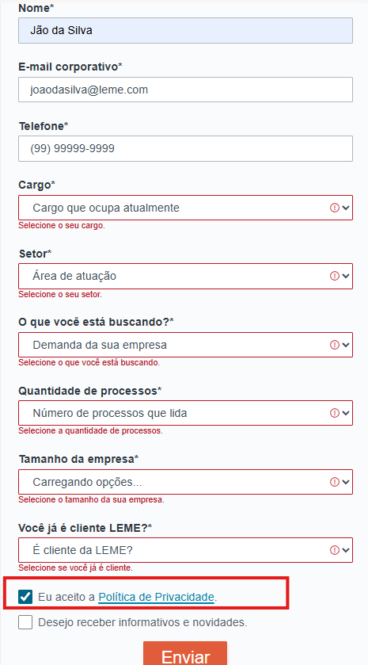


-------------------------------------------------------------------------------


### Cenário 23: Politica De Privacidade Não Marcado
Testar se está aceitando o checkbox não marcado para aceitar a politica de privacidade

**Requisitos**  
Estar dentro da página de contatos "https://homologa.lemeforense.com.br/contato/"

```
**Passo a passo**  
1. Digitar um nome completo (Ex: João da Silva)
2. Digitar e-mail corporativo válido
3. Digitar um telefone válido
4. Selecionar um cargo
5. Selecionar um setor
6. Selecionar o que você está buscando
7. Selecionar a quantidade de processos
8. Selecionar o tamanho da empresa
9. Selecionar a opção NÃO no campo "você já cliente LEME?"
10. Não aceitar o termo de política de privacidade
11. Aceitar receber informativos e novidades.
```
**Critério de aceitação**  
Deve aceitar com a politica de privacidade não marcado no checkbox

**Resultado**  
Não está aceitando com checkbox politica e privacidade não marcado, está informando que é necessário marcar, e não finaliza o processo por conta do erro nos outros campos 

**Evidência referente ao cenário 23**
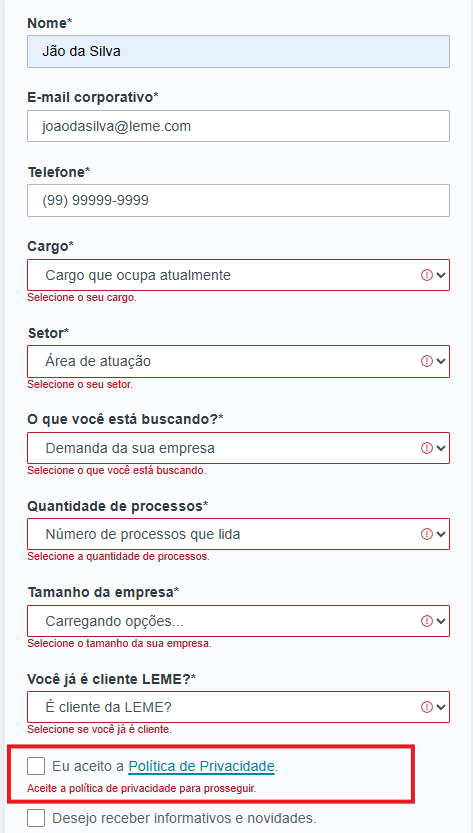


-------------------------------------------------------------------------------


### Cenário 24: Receber Informações E Novidades Marcado
Testar se está aceitando o checkbox não marcado para aceitar a politica de privacidade

**Requisitos**  
Estar dentro da página de contatos "https://homologa.lemeforense.com.br/contato/"

```
**Passo a passo**  
1. Digitar um nome completo (Ex: João da Silva)
2. Digitar e-mail corporativo válido
3. Digitar um telefone válido
4. Selecionar um cargo
5. Selecionar um setor
6. Selecionar o que você está buscando
7. Selecionar a quantidade de processos
8. Selecionar o tamanho da empresa
9. Selecionar a opção SIM no campo "você já cliente LEME?"
10. Aceitar o termo de política de privacidade
11. Aceitar receber informativos e novidades.
```
**Critério de aceitação**  
Deve aceitar com o checkbox "Desejo receber informativos e novidades" marcado

**Resultado**  
Está aceitando com checkbox "Desejo receber informativos e novidades", não finaliza o processo por conta do erro nos outros campos 

**Evidência referente ao cenário 24**
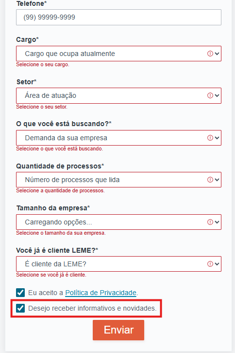


-------------------------------------------------------------------------------


### Cenário 25: Receber Informações E Novidades Não Marcado
Testar se está aceitando o checkbox não marcado para aceitar a politica de privacidade

**Requisitos**  
Estar dentro da página de contatos "https://homologa.lemeforense.com.br/contato/"

```
**Passo a passo**  
1. Digitar um nome completo (Ex: João da Silva)
2. Digitar e-mail corporativo válido
3. Digitar um telefone válido
4. Selecionar um cargo
5. Selecionar um setor
6. Selecionar o que você está buscando
7. Selecionar a quantidade de processos
8. Selecionar o tamanho da empresa
9. Selecionar a opção SIM no campo "você já cliente LEME?"
10. Aceitar o termo de política de privacidade
11. Não aceitar receber informativos e novidades.
```
**Critério de aceitação**  
Deve aceitar com o checkbox "Desejo receber informativos e novidades" não marcado

**Resultado**  
Está aceitando com checkbox "Desejo receber informativos e novidades", não finaliza o processo por conta do erro nos outros campos 

**Evidência referente ao cenário 25**
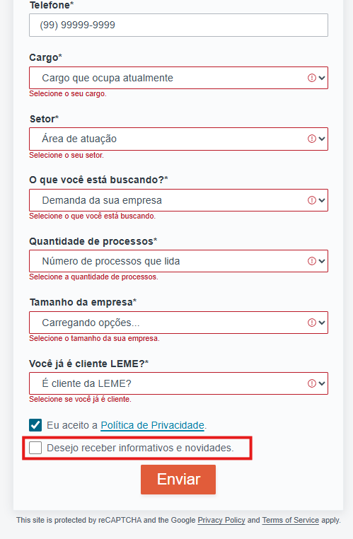


-------------------------------------------------------------------------------


### Cenário 26: Teste de Responsividade
Apenas validar a responsividade do sistema

**Evidência referente ao cenário 26**
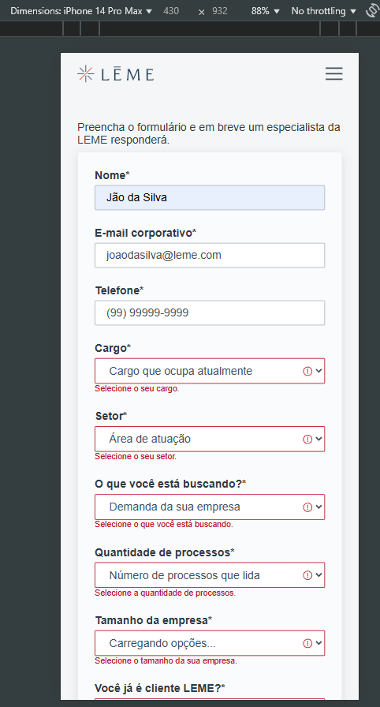