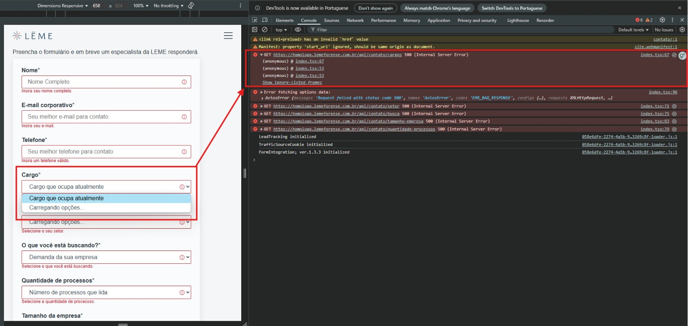
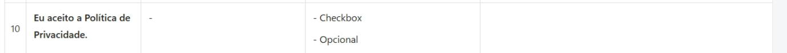

# ✅ Testes na Tela de Contato da LEME

Este repositório contém os **cenários de testes manuais** realizados na **tela de contato** do site da [LEME Forense](https://homologa.lemeforense.com.br/contato/). O objetivo foi validar o correto funcionamento dos campos do formulário e garantir que a experiência do usuário esteja de acordo com os requisitos passados pelo time de design.

## 🧪 Tipos de Testes Aplicados

Foram utilizados diferentes tipos de testes para garantir a cobertura completa do formulário:

- **Teste Funcional Positivo**  
  Testa o comportamento esperado com entradas válidas e completas.

- **Teste Funcional Negativo**  
  Testa comportamentos inesperados e campos obrigatórios não preenchidos.

- **Teste de Validação de Campo Obrigatório**  
  Confirma se os campos obrigatórios não permitem submissão vazia.

- **Teste de Máscara/Formatação**  
  Valida se o campo telefone, por exemplo, aplica o formato correto.

- **Teste de Select**  
  Verifica se os campos de seleção apresentam as opções e permitem a escolha correta.

---

## 📋 Lista de Cenários de Teste

- **Cenário 01:** Validação do Campo Nome Preenchido  
- **Cenário 02:** Validação do Campo Nome Vazio  
- **Cenário 03:** Validação do Campo E-mail Corporativo Preenchido  
- **Cenário 04:** Validação do Campo E-mail Não Corporativo  
- **Cenário 05:** Validação do Campo E-mail Corporativo Vazio  
- **Cenário 06:** Validação do Campo E-mail Sem Domínio  
- **Cenário 07:** Validação do Campo Telefone Preenchido  
- **Cenário 08:** Validação do Campo Telefone Vazio  
- **Cenário 09:** Cargo Selecionado  
- **Cenário 10:** Cargo Não Selecionado  
- **Cenário 11:** Setor Selecionado  
- **Cenário 12:** Setor Não Selecionado  
- **Cenário 13:** O que Você Está Buscando Selecionado  
- **Cenário 14:** O que Você Está Buscando Não Selecionado  
- **Cenário 15:** Quantidade De Processos Selecionados  
- **Cenário 16:** Quantidade De Processos Não Selecionado  
- **Cenário 17:** Tamanho da Empresa Selecionado  
- **Cenário 18:** Tamanho da Empresa Não Selecionado  
- **Cenário 19:** Campo Você Já É Cliente LEME (SIM)  
- **Cenário 20:** Campo Você Já É Cliente LEME (NÃO)  
- **Cenário 21:** Campo Você Já É Cliente LEME (Vazio)  
- **Cenário 22:** Política de Privacidade Marcada  
- **Cenário 23:** Política de Privacidade Não Marcada  
- **Cenário 24:** Receber Informações e Novidades Marcado  
- **Cenário 25:** Receber Informações e Novidades Não Marcado  
- **Cenário 26:** Teste de responsividade

---

## 🐞 Erros Encontrados

#### Erro 1:
Durante os testes, foi identificado um **bug crítico** que impede o funcionamento adequado de alguns campos do tipo `select`. Os seguintes campos **não carregam as opções de resposta** corretamente, exibindo apenas a mensagem `"Carregando opções..."`, o que impossibilita a seleção e bloqueia o envio do formulário:

- **Cargo**
- **Setor**
- **O que você está buscando?**
- **Quantidade de processos**
- **Tamanho da empresa**

Ao abrir o console do navegador (DevTools), foram identificadas diversas falhas com status 500 - Internal Server Error, nos seguintes endpoints:

#### Erro 2:
Segundo a documentação, o campo **Aceitação politica de privacidade** está marcado como "Opcional". No entanto, o comportamento esperado em sistemas que envolvem coleta de dados pessoais é que o aceite da política de privacidade seja obrigatório.

Recomendação que seja atualizado a documentação para refletir corretamente essa obrigatoriedade (não pode permanecer como “Opcional”).